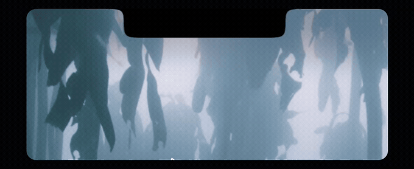

# preannounce

> 🌐 English | [中文](README_CN.md)

**A tiny macOS daemon that shows a 3-second countdown under the notch before any automation takes over your cursor, keyboard, or foreground app.**



AI agents can drive your Mac. Some of what they do is invisible — reading a window through the accessibility API, editing text in the background. Some of it is not: moving your real mouse, typing into whatever you have focused, or pulling an app to the front while you are working in another one.

`preannounce` covers the second category. Before the action happens, a capsule slides out below the notch and tells you what is about to happen. You get three seconds to react. If you do nothing, the action proceeds. If you hover the capsule, the countdown **pauses** and the text turns into an `×` — click it and the action is cancelled, and the caller is told to give up.

## What it intercepts

| Kind of intrusion | Example |
|---|---|
| Your real mouse is taken | an agent clicking by coordinates in your app |
| Your real keyboard is used | an agent typing into your focused window |
| Foreground is stolen | `open -a Dia`, AppleScript `activate` |
| What you are looking at changes | an agent navigating your real browser |
| Other | restarting the Dock, interactive screenshot, putting the Mac to sleep |

Actions that do **not** disturb you are never intercepted (background accessibility edits, reading files), so normal automation does not pay a 3-second tax.

## Interaction

- **Do nothing** → it counts down 3, 2, 1 and then acts. Your own mouse and keyboard activity does *not* interrupt it.
- **Hover the capsule** → the text becomes an `×` and the countdown **pauses** (the capsule reads this as "I am hesitating").
- **Move away without clicking** → the text comes back and the countdown **resumes** where it paused.
- **Click the capsule** → visible press feedback (it shrinks to 95% and darkens for 0.12s), then the action is cancelled.

There is no separate button: the whole capsule is the target from start to finish.

## Install

```bash
bash scripts/build.sh              # produces dist/预告.app
cp -R dist/预告.app ~/Applications/
open ~/Applications/预告.app        # first launch shows a ready banner and installs a login agent
```

Autostart uses `~/Library/LaunchAgents/com.kai.preannounce.plist` (`RunAtLoad` + `KeepAlive`, so launchd restarts it if it ever dies — measured: back up within 500ms of a `kill -9`).

A prebuilt universal app is committed under `dist/预告.app` if you would rather not build.

## Command line

```bash
BIN="$HOME/Applications/预告.app/Contents/MacOS/Preannounce"
"$BIN" announce --message "{n} 秒之后将打开 Dia"   # 0 = warned, go ahead
                                                   # 3 = could not warn, abort
                                                   # 4 = user cancelled, abort
"$BIN" diagnose                                    # Chinese report: who interrupts you the most
```

`{n}` is replaced by the countdown number. Any automation that is about to take over the user's foreground should call this first and honour the exit code.

There is also a small JSON protocol on `~/Library/Caches/preannounce/guard.sock` (`announce`, `ping`, `cancel`) for callers that prefer not to spawn a process.

> Fail-safe is the point: if the warning cannot be delivered, the caller is expected to abandon the action. The guarantee is not "the daemon is always alive" but **"either you were told, or nothing happened"**.

## Integrations

| Where | File | Trigger |
|---|---|---|
| pi-computer-use | `integrations/patch-pi-computer-use.sh` | an act that will use real HID input (real mouse or keyboard) |
| Pi bash tool | `integrations/pi-bash-guard.ts` | commands that steal focus: `open -a`, `osascript … activate`, webbridge writes, `killall Dock`, interactive screenshots, `pmset sleepnow` |

`pi update npm:@injaneity/pi-computer-use` overwrites the patch — re-run the script afterwards (it is idempotent).

## How light is it

The resident process **does not link AppKit**:

| | |
|---|---|
| Private physical memory | **3.2 MB** (`vmmap` physical footprint) |
| `ps` RSS | 8.5 MB (inflated — mostly shared framework pages) |
| Idle CPU | **0.0%** (total CPU time does not move over a 5s sample) |
| Binary | 464 KB universal (232 KB per arch) |

The GUI is a second binary that the daemon spawns only while a capsule is on screen, then exits. Its ~200ms cold start is hidden *before* the countdown starts, so **you always see the full 3 seconds** — the extra latency is only visible to the caller.

## Design principles

1. **Zero permissions.** No accessibility, no screen recording, no notification permission. The capsule is a self-drawn `NSPanel`, not a system notification.
2. **It must never steal focus.** A tool that exists to prevent focus stealing cannot itself steal focus.
3. **Fail safe.** No warning, no action.
4. **Never tax automation that does not disturb you.**

## Docs

- `AGENTS.md` — project rules and the interaction contract
- `DESIGN.md` — problem definition, decisions, and the pitfalls that were actually hit
- `README_CN.md` — 中文说明

## Acknowledgements

The notch capsule (layered glass, slide-in/out with a gaussian-blur transition, and the fact that `NSWindow.animator()` does not animate on a non-activating LSUIElement window — hence the manual per-frame timer) is a technique lifted from **褪黑素 / Melatonin**, another small self-written macOS utility on the same machine, and reused here.
